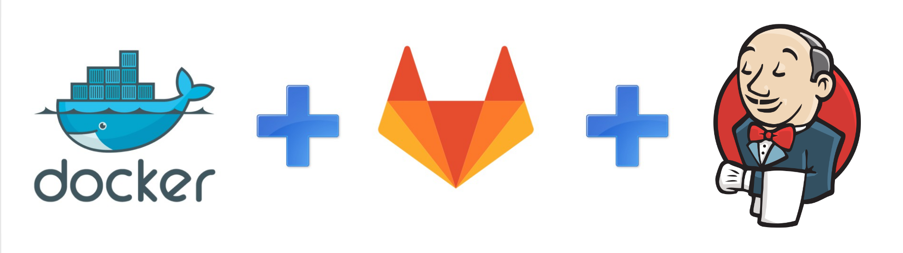
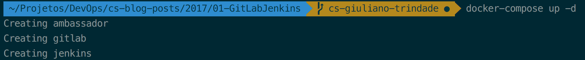
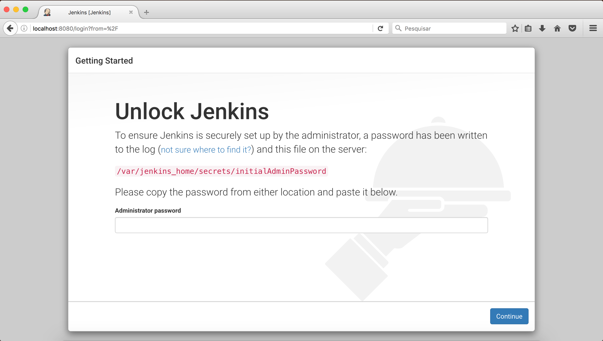
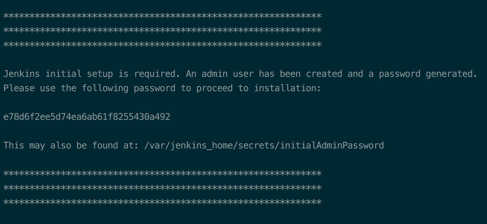
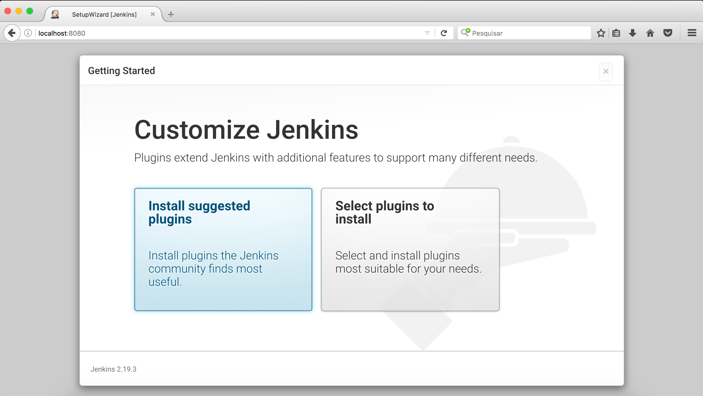
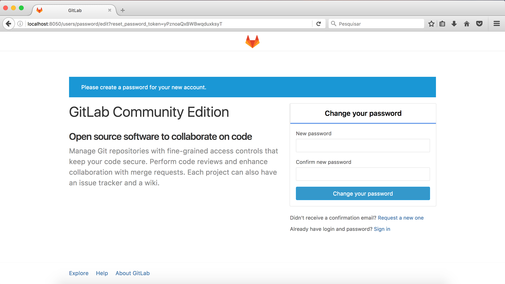

GitLab + Jenkins: Uma integração poderosa
=========================================




Fala pessoal! Hoje vamos falar um pouco aqui no Blog sobre a integração entre o GitLab e o Jenkins, que pode adiantar muito a sua vida. Vamos lá?

O início
-------------
Para começar nosso projeto, a primeira coisa que precisamos é ter o [Docker](https://www.docker.com/) instalado, pois é com ele que vamos subir os serviços do GitLab e do Jenkins por meio do [docker-compose](https://docs.docker.com/compose/) *(vamos falar mais pra frente* :sweat_smile:*).*
Para instalar, verifique qual SO você está usando e *Go!Go!Go!* :feelsgood:. É só seguir esse [tutorial](https://docs.docker.com/engine/installation/).

Para a instalação do docker-compose é só seguir a [documentação oficial](https://docs.docker.com/compose/install/) que vai dar certo, pode confiar. :metal:

Docker Compose
--------------
Com o docker-compose podemos criar, configurar e subir todos os serviços que vamos precisar de uma só vez, com um único comando. Para isso, vamos criar um arquivo ``` docker-compose.yml ``` na pasta de sua preferência e copiar todo o conteúdo abaixo para dentro dele. Não se preocupe, vou explicar cada item. :relieved:
Se você quiser saber mais, é só acessar [aqui](https://docs.docker.com/compose/overview/).


```yml

version: '2'

services:
    ambassador:
      image: cpuguy83/docker-grand-ambassador
      container_name: ambassador
      hostname: ambassador01
      network_mode: "bridge"
      volumes:
        - "/var/run/docker.sock:/var/run/docker.sock"
      command: "-name jenkins -name gitlab "

    jenkins:
      image: jenkins:latest
      container_name: jenkins
      hostname: jenkins01
      network_mode: "bridge"
      links:
        - "ambassador:gitlab"
      ports:
        - "8080:8080"
        - "50000:50000"
      volumes:
        - ~/Projects/jenkins_home:/var/jenkins_home

    gitlab:
        image: gitlab/gitlab-ce
        container_name: gitlab
        hostname: gitlab.teste.com
        restart: always
        network_mode: bridge
        links:
          - "ambassador:jenkins"
        ports:
           - "443:443"
           - "8050:80"
           - "22:22"
        volumes:
          - ~/Projects/gitlab/config:/etc/gitlab
          - ~/Projects/gitlab/logs:/var/log/gitlab
          - ~/Projects/gitlab/data:/var/opt/gitlab


```


* **version: '2'**: Com a versão 2 da sintaxe do docker-compose conseguimos usar todas as novas funcionalidades disponíveis do Compose e do Docker Engine.

* **services**: Todos os serviços que serão utilizados no nosso projeto devem estar listados abaixo dele. *(A estrutura de services só funciona com a versão 2 da sintaxe).*

* **nome-do-serviço**: Nome para identificar o serviço no docker-compose.
  * **image:** Imagem docker que será utilizada para o serviço.
  * **container_name:** Atribui um nome ao container, tornando mais fácil a administração.
  * **hostname:** Adiciona um nome ao host. Vamos usar os hostnames nas próximas etapas.
  * **network_mode:** Configurações de rede para o container. O modo bridge sobe todos os containers na mesma rede.
  * **links:** Faz o link entre os containers, para que a comunicação por nome seja possível. (Falei que o hostname era importante :relieved:)
  * **ports:** Você pode definir quais portas serão abertas interna e externamente no container. Todos os padrões para definição de portas podem ser encontrados [aqui](https://docs.docker.com/compose/compose-file/#/ports).
  * **volumes:** Monta *paths* ou volumes nomeados, especificando um caminho no host ou não. Todos os tipos de montagem de volume [aqui](https://docs.docker.com/compose/compose-file/#volumes-volumedriver).


Essa é só uma explicação básica da estrutura do YAML para o *docker-compose file* que vamos utilizar. Caso você queira se aprofundar ainda mais no assunto, a documentação oficial pode ajudar nisso :smiley:. Você pode acessá-la  *[aqui](https://docs.docker.com/compose/compose-file/).*

:warning: A identação é essencial para o funcionamento do docker-compose.

Agora que o *docker-compose.yml* foi configurado e entendido, vamos começar com oque realmente interessa. *Let's go! :goberserk:*


Serviços
--------

Antes de prosseguir com o projeto, uma breve explicação sobre cada serviço que estamos subindo.
Voltaremos com a programação normal em seguida, nesse mesmo canal e nesse mesmo horário.

#### Docker Grand Ambassador

Esse serviço permite a comunicação bidirecional entre containers. Isso significa que ele criará automaticamente um proxy em todas as portas expostas, e também detectará automaticamente as alterações feitas em um container ajustando o servidor proxy de acordo com a necessidade.(Por exemplo, um container é reiniciado e seu IP muda). Ou seja, ele vai nos poupar o trabalho de fazer um servidor DNS. :trollface:

Você pode ler mais sobre o Docker Grand Ambassador [aqui](https://github.com/cpuguy83/docker-grand-ambassador).

### Jenkins

O [Jenkins](https://jenkins.io/) permite a automatização dos processos no nosso projeto. Podemos automatizar testes, builds e etc., escolhendo quais serão as ações que vão acionar nosso *Job*.

Vamos ver mais sobre essa integração ainda neste post.


### GitLab

O Gitlab vai ser o nosso gerenciador de repositório. Ele é muito parecido com o [GitHub](https://github.com/), mas com a vantagem de podermos subir o serviço localmente. Além disso, a integração dele com o Jenkins é muito grande (aliás esse é o propósito deste post :suspect:). Por meio de um WebHook vamos conseguir a comunicação direta com o Jenkins, eliminando a necessidade de ele ficar checando o repositório constantemente. O GitLab vai informar o Jenkins quando um evento ocorre (um *Merge Request* de uma *feature branch* na *branch Develop*, por exemplo) e com isso um Job ligado ao Jenkins pelo WebHook é iniciado.

Agora, depois de tanta <s>enrolação</s> explicação, é hora de a mágica acontecer.


Subindo o ambiente
==================

### Iniciando os serviços

No diretório em que você criou o arquivo ```docker-compose.yml``` execute o comando:

```bash
  docker-compose up
```
A saída deverá ser parecida com essa. (Pelo menos eu espero :no_mouth:):



Caso você não tenha as imagens docker dos serviços que estamos subindo, o docker-compose vai fazer o download automaticamente.

### Jenkins

Após a inicialização dos serviços com o docker-compose, vamos fazer a configuração inicial do Jenkins. Acesse a url [http://localhost:8080/](http://localhost:8080/) e você será direcionado para a página inicial do Jenkins.



Para configurá-lo, vamos inserir a chave que ele gerou no momento da instalação. Existem duas maneiras de encontrar a chave, a mais simples é digitar no terminal ```docker logs -f jenkins```. Ele vai exibir assim:

  

Há outro modo que é acessando a pasta ```/var/jenkins_home/secrets/initialAdminPassword```, mas dá muito trabalho, melhor ficarmos com o primeiro mesmo. :sleeping:

Após colocar a senha inicial, o Jenkins vai exibir a página de customização dos plugins iniciais. Selecione **Install sugested plugins** e aguarde o donwload e instalação.bundle exec pod install



Pronto, o Jenkins já está pronto para ser utilizado!


### GitLab

Com o GitLab o processo é bem mais simples. Só acessar a página inicial dele [http://localhost:8050/](http://localhost:8050/), e colocar uma senha com no mínimo 8 caracteres.



Agora estamos com o ambiente pronto e podemos começar a configuração da integração. Segura que o filho é seu!


